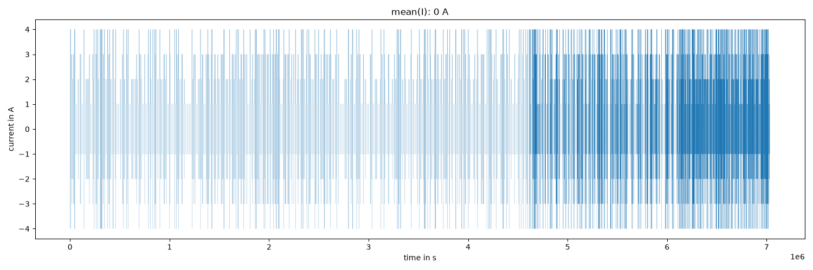
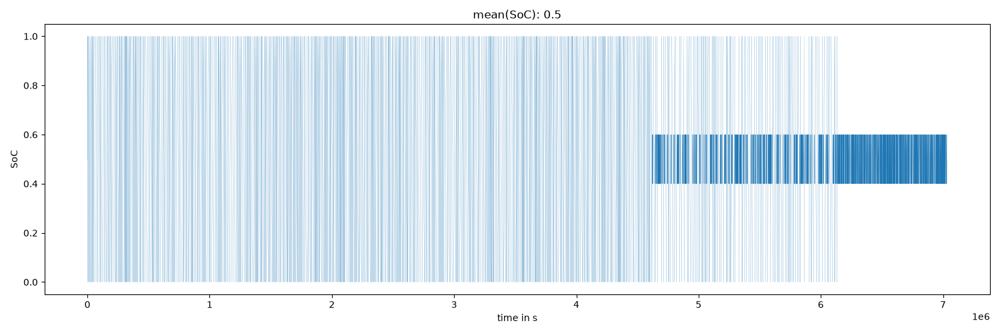
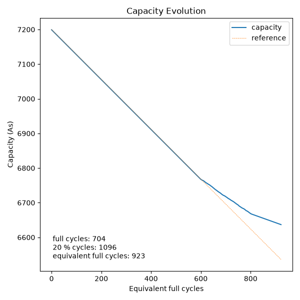
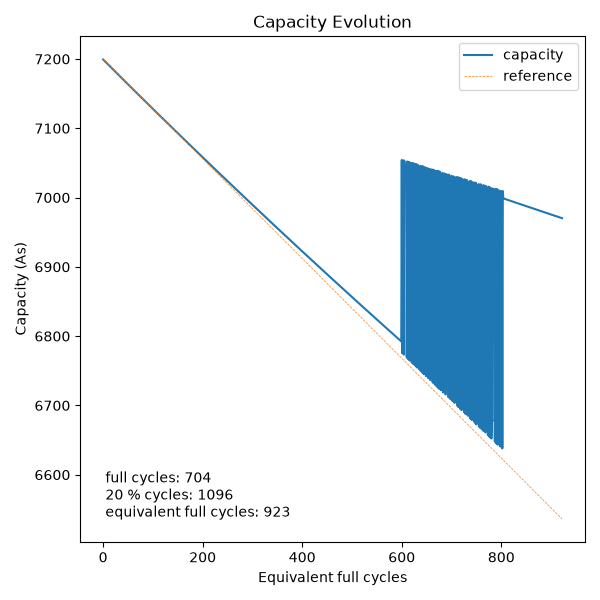

# Battery Cycle Lab

[](https://github.com/count-doku/random-cycles-msb/actions/workflows/ci.yml)

Synthetic lithium-ion aging profiles and a cycle counter that reads them back.
Written as the hands-on part of the exercise *State Estimation and Diagnosis of
Battery Systems* at TU Berlin, where students implement the counter themselves
and compare it against this reference.

The question behind it: **how do you count battery cycles when they are not all
the same depth?** A cell that sees 100 shallow cycles has not aged like a cell
that saw 100 full ones, so a counter that just tallies charge/discharge
transitions gives the wrong answer. The counter here resolves cycle *depth*,
converts it into equivalent full cycles, and only then applies capacity fade.

## The two halves

**`cycle_generator.py` — the truth.** Builds a current profile out of symmetric
cycles around mid state of charge. Every cycle returns to the SoC it started
at, so the profile is charge neutral by construction and the ground truth (how
many cycles, at what depth) is known exactly.

```
SoC   /\                         I   ___      ___
     /  \                                 |    |
         \    /                           |____|
          \  /
           \/
```

The profile has three segments of 600 cycles each:

| Segment | Content | Why |
| --- | --- | --- |
| 1 | full cycles (DoD 1.0) | the easy case |
| 2 | 20 % full, 80 % partial | the hard case — depths interleaved |
| 3 | partial cycles (DoD 0.2) | the shallow case |

Segment 2 is the point of the exercise. In the current signal alone, a deep and
a shallow cycle look the same; only the charge excursion tells them apart.

**`cycle_counter.py` — the estimator.** Walks the signal sample by sample and
closes a cycle when it has seen both *two current sign changes* (charge ↔
discharge) and *three crossings of the starting charge level*. Requiring both
is what makes segment 2 work. Each counted cycle yields its depth of discharge,
which feeds the aging model: 2000 full cycles to 80 % capacity, but 1400
equivalent full cycles when they are made of 20 % partial cycles — shallow
cycling is gentler per unit of throughput.

A trailing incomplete cycle is deliberately **not** counted. Its depth is
unknown, and guessing it would bias the aging result.

## Results

Current profile and the resulting SoC, three segments visible:




Capacity fade over equivalent full cycles. The dashed line is the pure
full-cycle reference; the trace bends away from it where partial cycles start
to dominate, because they fade the cell more slowly:



## The teaching case: what goes wrong

`reduce_capacity(..., buggy=True)` reproduces the mistake students reliably
make — indexing the aging curve with the *already faded* capacity and the
absolute cycle count, so the lookup is re-read from a moving origin. Run it:

```bash
uv run python cycle_counter.py --buggy
```



The capacity jumps between the two lookup tables in the mixed segment and even
*increases* — a battery that heals itself is a good sign the model is wrong.
Keeping this reproducible behind a flag beats a comment saying "don't do this".

## Run it

```bash
uv sync --all-groups
uv run python cycle_generator.py   # writes aging_profile.csv (~700k samples) and two plots
uv run python cycle_counter.py     # reads the csv, writes CN_evolution.png
```

Expected output:

```
Counted full cycles:       704
Counted 20 % cycles:       1096
Equivalent full cycles:    923
Remaining capacity:        6636.8 As
```

704 + 1096 = 1800 = the 1800 cycles that went in. Numbers per run vary with the
random draw in segment 2; the total does not.

```bash
uv run pytest        # round-trip: what the generator writes, the counter reads back
uv run ruff check .
```

## Model parameters

| Parameter | Value | Note |
| --- | --- | --- |
| Nominal capacity `C_N` | 7200 As (2 Ah) | |
| Currents | 1–4 A | 0.5 C to 2 C |
| Sample time | 10 s | must divide the quarter cycle evenly |
| End of life | 80 % `C_N` | after 2000 equivalent full cycles |

The generator raises `ValueError` rather than rounding when a current and
sample time do not produce a whole number of samples per quarter cycle — a
fractional sample silently biases the charge balance and breaks the round trip.

`CoulombCounter` carries coulombic efficiency and self-discharge current, both
off by default. They are the knobs for showing students how a real integrator
drifts away from the ideal one.

## License

MIT — see [LICENSE](LICENSE).
